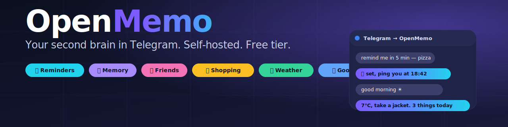
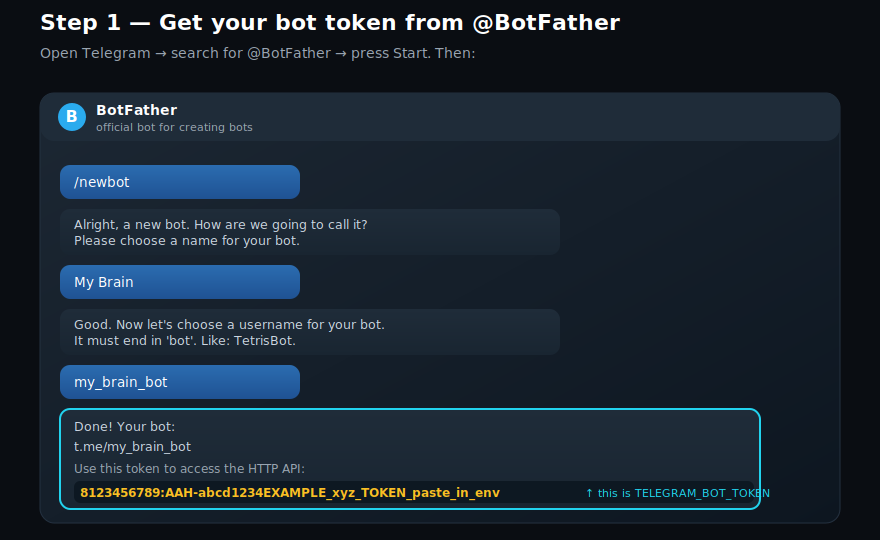
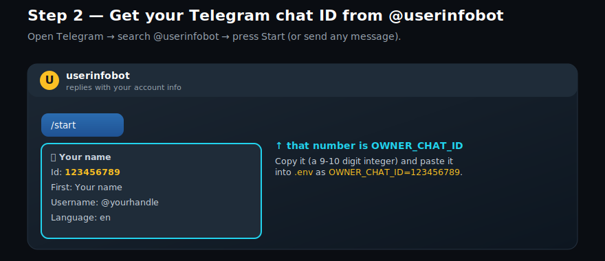
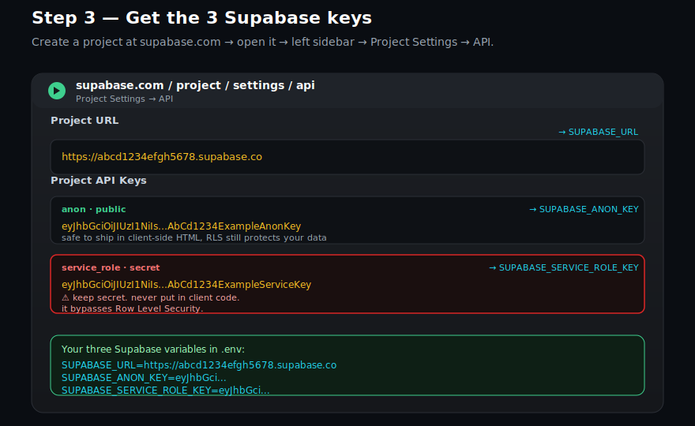
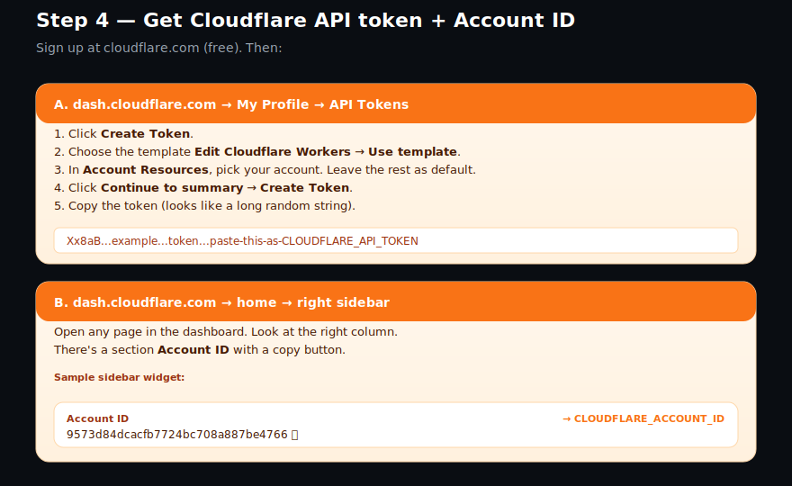
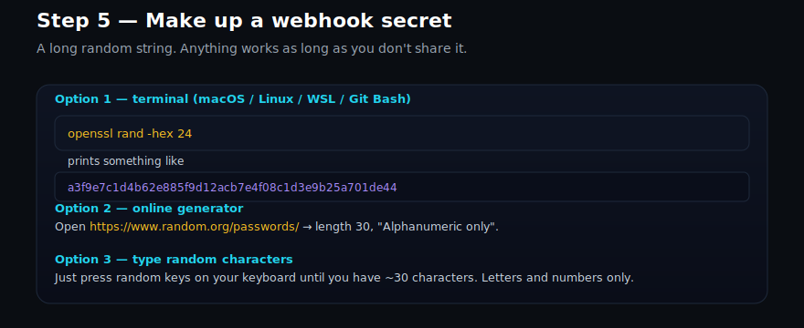
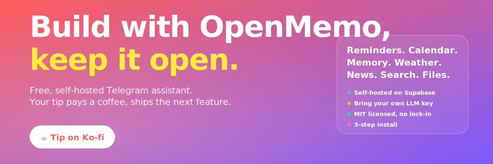

<p align="center">
  
</p>

<h1 align="center">OpenMemo</h1>

<p align="center">
  <b>Your second brain in Telegram.</b><br/>
  Self-hosted. Free tier. MIT licensed.
</p>

<p align="center">
  <a href="https://ko-fi.com/haerincode"></a>
  
  
  
</p>

---

## Why

You already live in Telegram. You don't want another app for
reminders, another for notes, another for the shopping list, another
for the calendar. OpenMemo is one bot that does all of it, plus
weather, news, web search and a memory that learns about you.

Type to it in plain language. It acts. It replies in **whatever
language you write to it**.

```
remind me in 30 min to take the pizza out
add milk and bread to shopping
how many days until Paul's birthday
good morning
recuérdame mañana llamar a mamá
```

If it saves you time, [tip a coffee on Ko-fi](https://ko-fi.com/haerincode).

## Quick start (developers)

```bash
git clone https://github.com/haerincode/openmemo.git && cd openmemo
cp .env.example .env && $EDITOR .env   # paste your keys, see below
supabase login
./scripts/setup.sh
```

If you need the **step-by-step with screenshots**, scroll to
[Install in 3 steps](#install-in-3-steps).

## What you get

| | |
|---|---|
| 📅 **Reminders** | Recurring or one-off, batched in one message, with pre-alerts. |
| 🛒 **Lists & shopping** | Add items, mark them bought, delete, list. All by chat. |
| 📝 **Notes** | Free-form, semantic search. |
| 🗓 **Web calendar** | Private URL, month/week/day/list views, color picker. |
| 👥 **Friends** | Birthdays, emails, phones. The bot warns before birthdays. |
| 📍 **Addresses** | Optional coordinates, returns Google Maps links. |
| 🌤 **Weather** | Local conditions + forecast for outfit advice. |
| 📰 **Good news** | A few uplifting headlines on demand. |
| 🔎 **Web search** | Live lookups when the answer isn't in your data. |
| 📂 **Files** | Private bucket, retrieve by name or tag. |
| 🧠 **Memory** | Picks what's worth remembering and reuses it next turn. |
| 🚨 **Proactive nudges** | Daily checks for collisions, birthdays, dropped habits. |
| 📓 **Journal** | Reflections, ideas, goals. Searchable later. |
| ✅ **Habits** | Track recurring practices with streaks. |
| 📧 **Email backup** | Sends any reminder to your inbox on demand. |

The agent is a tool-use loop. The LLM picks which database action
to run, chains them, then writes the reply.

## What it does NOT do

- No multi-user. One owner per deployment.
- No web app. Telegram is the UI; the calendar is read-only.
- No phone/Whatsapp client. Telegram only.
- No voice transcription yet (audio messages are kept but not
  parsed).

## Built on

[Supabase](https://supabase.com) (Postgres + pgvector + Storage +
Edge Functions + pg_cron) ·
[Deno](https://deno.land) ·
[DeepSeek](https://platform.deepseek.com) (or any OpenAI-compatible
LLM) ·
[Cloudflare Pages](https://pages.cloudflare.com) ·
[Telegram Bot API](https://core.telegram.org/bots).

---

## Install in 3 steps

The whole thing takes about 15 minutes the first time. The
walkthrough below assumes you've never written code before.

### Step A. Install tools and clone

You need [Git](https://git-scm.com),
[Node 18+](https://nodejs.org),
and the [Supabase CLI](https://supabase.com/docs/guides/cli).

**macOS** (Terminal):

```bash
brew install git node supabase/tap/supabase
```

**Windows** (PowerShell as admin). The Supabase CLI uses
[Scoop](https://scoop.sh):

```powershell
winget install Git.Git OpenJS.NodeJS
Set-ExecutionPolicy -ExecutionPolicy RemoteSigned -Scope CurrentUser
irm get.scoop.sh | iex
scoop bucket add supabase https://github.com/supabase/scoop-bucket.git
scoop install supabase
```

**Linux** (Debian/Ubuntu):

```bash
sudo apt install git nodejs
curl -fsSL https://github.com/supabase/cli/releases/latest/download/supabase_linux_amd64.tar.gz \
  | tar -xz -C /tmp && sudo mv /tmp/supabase /usr/local/bin/
```

Then:

```bash
git clone https://github.com/haerincode/openmemo.git
cd openmemo
cp .env.example .env
supabase login   # opens a browser, one-time
```

> **Windows note:** the installer needs **Git Bash** or **WSL** (not
> plain PowerShell). Right click in the openmemo folder →
> "Git Bash here", and run `supabase login` and the rest from there.

### Step B. Open `.env` and fill in the keys

Open `.env` in any editor. Required to run the bot (6 values):

```
OWNER_CHAT_ID=
TELEGRAM_BOT_TOKEN=
TELEGRAM_WEBHOOK_SECRET=
LLM_API_KEY=
SUPABASE_URL=
SUPABASE_SERVICE_ROLE_KEY=
```

Required only if you want the web calendar deployed (3 more):

```
SUPABASE_ANON_KEY=
CLOUDFLARE_API_TOKEN=
CLOUDFLARE_ACCOUNT_ID=
```

Optional (skip the lines you don't want):

```
RESEND_API_KEY=          # email backup of reminders, on demand
OWNER_EMAIL=
OPENWEATHER_API_KEY=     # weather in greetings
GNEWS_API_KEY=           # good-news headlines (or NEWSAPI_API_KEY)
TAVILY_API_KEY=          # live web search (or BRAVE_*, SERPAPI_*)
```

> **Everything here is free.** Supabase, Cloudflare and Telegram
> have permanent free tiers that fit one user. DeepSeek gives a
> starter credit that lasts months. You never need a credit card.

How to get each key, with screenshots:

#### 1. Telegram bot token → `TELEGRAM_BOT_TOKEN`

Open Telegram, search [`@BotFather`](https://t.me/BotFather), press
Start. Send `/newbot` and follow the prompts. Copy the long token.



#### 2. Your Telegram chat ID → `OWNER_CHAT_ID`

In Telegram, search [`@userinfobot`](https://t.me/userinfobot),
press Start. It replies with your ID, a 9-10 digit number.



#### 3. Supabase URL + 2 keys

Sign up at [supabase.com](https://supabase.com), create a new
project (Free plan, region close to you). When ready, click
**Project Settings** → **API**.
Docs: [Supabase API keys](https://supabase.com/docs/guides/api/api-keys).



#### 4. Cloudflare API token + Account ID

Sign up at [cloudflare.com](https://www.cloudflare.com).
Docs:
[Find your Account ID](https://developers.cloudflare.com/fundamentals/account/find-account-and-zone-ids/) ·
[Create an API token](https://developers.cloudflare.com/fundamentals/api/get-started/create-token/).



#### 5. Webhook secret → `TELEGRAM_WEBHOOK_SECRET`

Any random string. Telegram uses it to verify webhook calls.
Generate one with
[random.org](https://www.random.org/passwords/?num=1&len=32&format=plain&rnd=new),
`openssl rand -hex 24`, or by mashing the keyboard ~30 times.



#### 6. DeepSeek API key → `LLM_API_KEY`

Go to [platform.deepseek.com](https://platform.deepseek.com), sign
in, open **API Keys**, click **Create**, copy.
Docs: [DeepSeek quickstart](https://api-docs.deepseek.com/quick_start/your-first-api-call).

> Want a different LLM? See [docs/llm-providers.md](docs/llm-providers.md).
> Anything OpenAI-compatible works.

#### 7. (Optional) Resend → email backup

If you want the bot to **email you a reminder when you ask it to**:
sign up at [resend.com](https://resend.com), create an API key, add
`RESEND_API_KEY` and `OWNER_EMAIL` to `.env`. The bot **only** sends
emails when you explicitly ask it to.

### Step C. Run the installer

```bash
./scripts/setup.sh
```

The script:

1. Links your Supabase project.
2. Applies all migrations (creates every table you need).
3. Pushes your `.env` as runtime secrets.
4. Deploys the four Edge Functions.
5. Configures the cron URLs.
6. Registers the Telegram webhook.
7. Deploys the web calendar to Cloudflare Pages and prints the URL.

Open Telegram, message your bot. The first turn it asks for your
local time so it can guess your timezone. Reply with `08:30` and
you're set.

---

## Talk to your bot

The bot replies in whatever language you type to it.

```
remind me in 1 minute to test the bot
every monday at 8 go to the gym
add milk, bread, eggs to shopping
mark milk as bought
add Paul: paul@example.com, phone +27 123, birthday 1992-04-12
how many days until Paul's birthday
save Paul's address: 123 Main St, Cape Town
what do I have today
delete the dentist
mail me what I have this week
good morning
tell me good news from tech
search the web for the latest pgvector release
send me my calendar
remember that I run 5K every wednesday
journal: today I'm anxious about the demo
recuérdame en 5 minutos cerrar la ventana
```

To force a language, run this once in the Supabase SQL editor:

```sql
UPDATE owner SET language = 'es' WHERE id = 1;  -- or 'en'
```

---

## Cost

For one user with around 50 messages a day:

- Supabase free tier covers it.
- DeepSeek: well under EUR 1 / month.
- Cloudflare Pages: free.
- Optional services (weather, news, web search, email): all have
  free tiers that fit one person.

## Security

- Only the chat id matching `OWNER_CHAT_ID` can talk to the bot.
- Telegram updates validated via the secret-token header.
- RLS on every user-data table; only the service role reads or
  writes, and the service role key never leaves your server.
- The web calendar URL is gated by a token enforced server-side via
  a SECURITY DEFINER RPC. The URL itself is a 32-char random slug
  (18 quintillion combinations).

## More docs

- [Architecture and project layout](docs/architecture.md)
- [Operating: redeploy, logs, tests, updates](docs/operating.md)
- [Use a different LLM provider](docs/llm-providers.md)
- [FAQ](#faq)

## FAQ

### What's the difference between the three Supabase keys?

| Key | What it is | Used by |
|---|---|---|
| `SUPABASE_ANON_KEY` | Public-by-design. RLS protects data. | The web calendar HTML. |
| `SUPABASE_SERVICE_ROLE_KEY` | Server-only secret. Bypasses RLS. | The bot's Edge Functions. Never ship to a client. |
| Supabase access token (`sbp_...`) | Account-wide admin token. | The Supabase CLI for migrations and deploys. Stored by `supabase login`. Not in `.env`. |

### Does `supabase db push` use the anon key?

No. The CLI uses the access token from `supabase login` and talks
to the Supabase Management API.

### Do I have to deploy the calendar to use the bot?

No. Skip the Cloudflare keys, answer "no" when the installer asks.
Deploy later with `DEPLOY_CALENDAR=yes ./scripts/setup.sh`.

### Can I run this on my own server instead of Supabase Cloud?

Yes. Self-hosting Supabase plus pg_cron and pg_net works. You
re-wire the migrations and deploy the Edge Functions yourself.

### How do I update OpenMemo when I `git pull`?

Re-run `./scripts/setup.sh`. Idempotent.

### What if `winget`/`brew`/`scoop` don't have my package?

Fall back to the official binary downloads:
[Supabase CLI releases](https://github.com/supabase/cli/releases),
[Node.js installers](https://nodejs.org/en/download),
[Git for Windows](https://git-scm.com/download/win).

### Can I delete my data?

Drop the Supabase project from your dashboard. Everything goes with
it.

---

## Contributing

Found a bug? Want a feature? Open an issue or a PR. Everything is
small and self-contained.

## Support OpenMemo

If this saves you time, support it on
[Ko-fi](https://ko-fi.com/haerincode). I keep shipping.

<p align="center">
  <a href="https://ko-fi.com/haerincode">
    
  </a>
</p>

## License

MIT. See [LICENSE](LICENSE).
